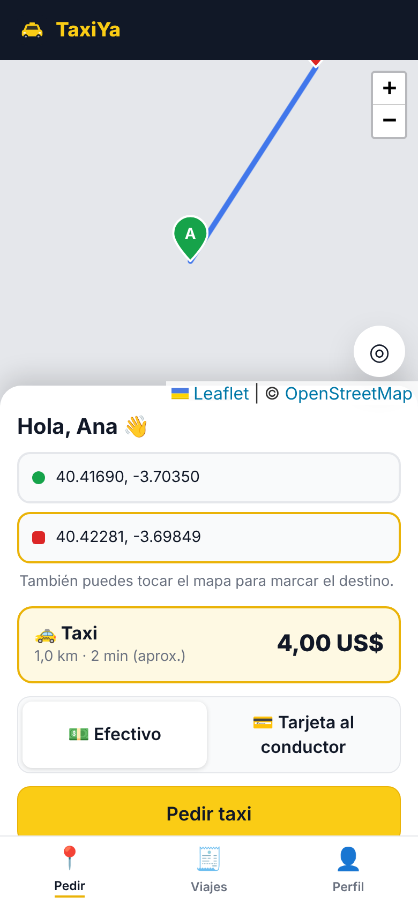
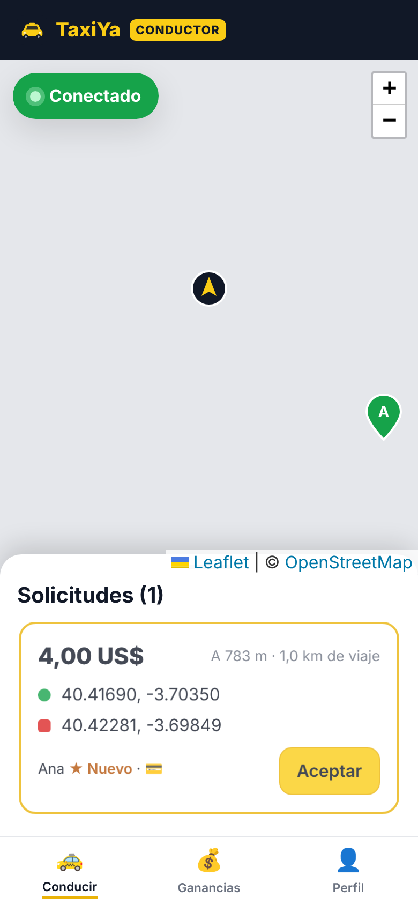
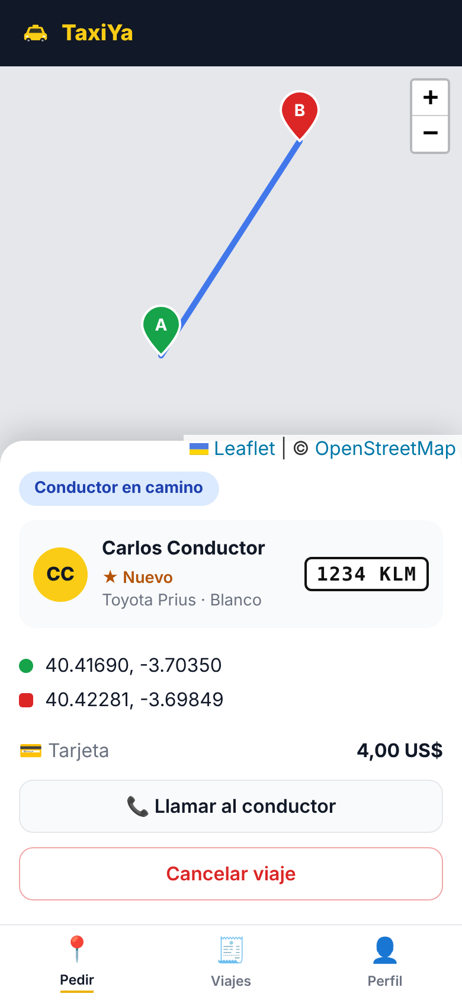
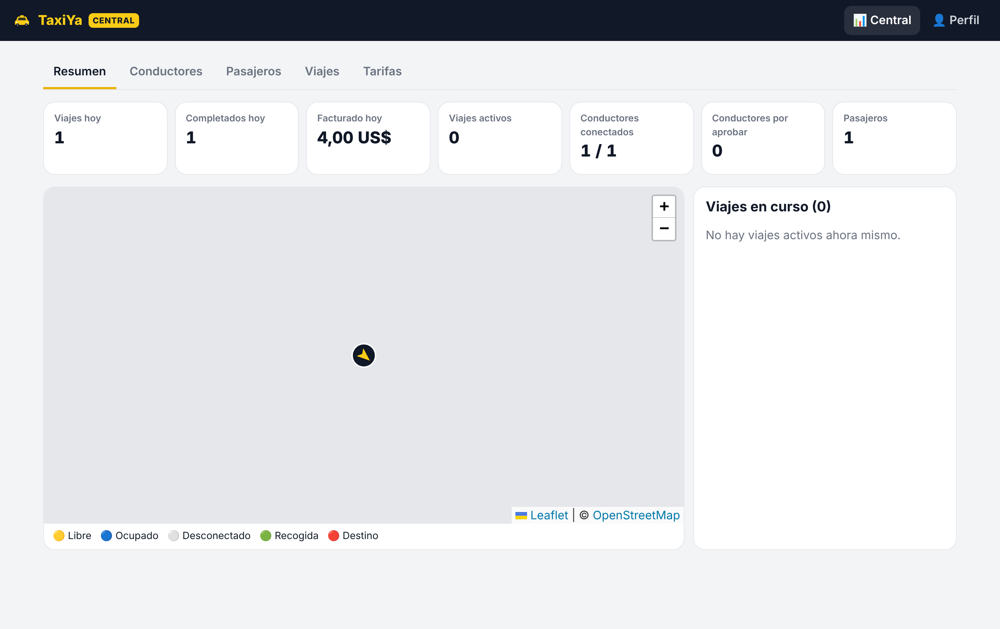

# 🚕 TaxiYa — App de Taxis

Aplicación para pedir taxis: web móvil (PWA, instalable en Android e iPhone) y **app Android (APK)**, con **tres perfiles**:

| Perfil | Qué puede hacer |
| --- | --- |
| **Pasajero** | Marca recogida y destino (GPS, buscador de direcciones o tocando el mapa), ve la ruta y el **precio antes de pedir**, elige efectivo o tarjeta, sigue al conductor **en tiempo real**, lo llama, cancela, valora el viaje y consulta su historial. |
| **Conductor** | Se registra con su vehículo, espera la aprobación de la central, se conecta/desconecta, recibe solicitudes cercanas con aviso por vibración, acepta, navega con Google Maps, marca *He llegado → Iniciar → Finalizar*, valora al pasajero y ve sus **ganancias** (hoy, semana, total). |
| **Central (administración)** | Panel con estadísticas del día, **mapa en vivo** de la flota y viajes en curso, aprobación/bloqueo de conductores y pasajeros, listado de viajes con filtros, cancelación de viajes y **configuración de tarifas** con vista previa. |

<p>



</p>


> En las capturas el mapa sale gris porque se hicieron en un entorno sin acceso a los mapas de OpenStreetMap; en uso normal se ven las calles.

## Tecnología

- **Backend:** Node.js 22 + Express 5 + Socket.IO (tiempo real) + SQLite integrado en Node (`node:sqlite`, sin compilación nativa). Sesiones con JWT y contraseñas con bcrypt.
- **Frontend:** React 19 + Vite + Leaflet con mapas de **OpenStreetMap** (sin claves de API ni costes).
- **Rutas y direcciones:** OSRM y Nominatim (a través del servidor, con caché). Si no responden, se usa una estimación en línea recta ×1,3 y la app sigue funcionando.
- Un único proceso sirve la API, el tiempo real y la PWA.

## Puesta en marcha (desarrollo)

Requisitos: **Node.js 22.13 o superior**.

```bash
cd app-taxis               # la app vive en esta carpeta del repositorio
npm install
npm run dev
```

- App: http://localhost:5173 (Vite, con recarga) — la API corre en el puerto 3000.
- Central: `admin@taxiya.local` / `admin12345` (solo en desarrollo; cámbialo con `ADMIN_EMAIL`/`ADMIN_PASSWORD`).

Para probar el flujo completo en un solo ordenador abre tres ventanas (una normal y dos de incógnito): pasajero, conductor y central.
El conductor puede usar el botón **▶ Simular** durante un viaje para que el coche recorra la ruta sin moverse de la silla, y si el navegador no da GPS puede **tocar el mapa** para fijar su posición.

## Producción

```bash
cp .env.example .env      # rellena JWT_SECRET y ADMIN_PASSWORD como mínimo
npm ci
npm run build
npm start                 # http://localhost:3000
```

O con Docker:

```bash
docker build -t taxiya --build-arg VITE_DEFAULT_CENTER="19.4326,-99.1332" .
docker run -d -p 3000:3000 -v taxiya-data:/data \
  -e JWT_SECRET="$(openssl rand -hex 32)" -e ADMIN_EMAIL=tu@correo.com -e ADMIN_PASSWORD='una-contraseña-larga' \
  taxiya
```

**Importante:**
- La geolocalización del navegador y la instalación como app **solo funcionan con HTTPS** (o en `localhost`). Pon el servidor detrás de un proxy con certificado (Caddy, Nginx + Let's Encrypt, Railway, Render, Fly.io…). Si usas Nginx, permite WebSockets en `/socket.io/`.
- Los servidores públicos de OSRM, Nominatim y de mapas de OpenStreetMap son gratuitos pero **para uso moderado**. Con tráfico real usa servidores propios o un proveedor (MapTiler, Stadia, LocationIQ…) y cambia `ROUTING_URL`/`GEOCODER_URL` y la URL de teselas en `client/src/components/MapView.tsx`.
- Haz copia de seguridad del archivo SQLite (`DB_PATH`).

Todas las variables están documentadas en [`.env.example`](.env.example).

## App Android (APK)

La carpeta `android/` contiene la app nativa (Capacitor): es la misma interfaz, empaquetada dentro del APK, con permisos de GPS y vibración.

**Descargar:** GitHub compila el APK automáticamente con cada cambio en `app-taxis/` (workflow *App de Taxis (APK Android)*) y lo publica en
**Releases → `taxiya-apk`**. Abre esa página desde el móvil, descarga el `.apk` e instálalo (Android pedirá permitir instalar apps de esa fuente).

**Primer uso:** la app pregunta la **dirección del servidor** (por ejemplo `https://taxis.midominio.com`), que debe ser accesible desde el móvil.
Para que venga ya configurada, ejecuta el workflow a mano (*Actions → App de Taxis (APK Android) → Run workflow*) indicando `server_url`,
o crea la variable de repositorio `TAXIYA_SERVER_URL` (*Settings → Secrets and variables → Actions → Variables*).
El servidor ya acepta peticiones de la app (orígenes `https://localhost` y `capacitor://localhost`); no hace falta configurar CORS.

> Para probar en la red de casa puedes usar `http://IP-DE-TU-PC:3000`, pero el GPS de Android solo funciona fiable con HTTPS en el servidor
> de producción. Para uso real, usa siempre HTTPS.

**Firma y actualizaciones:** sin configuración, el APK se firma con una clave de depuración distinta en cada compilación, así que para
instalar una versión nueva hay que **desinstalar la anterior**. Para firmar siempre con tu clave (necesario para actualizar sin desinstalar
y para Google Play), crea una vez el almacén de claves y guárdalo en los secretos del repositorio:

```bash
keytool -genkeypair -v -keystore taxiya.keystore -alias taxiya -keyalg RSA -keysize 2048 -validity 10000
base64 -w0 taxiya.keystore   # copia el resultado
```

Secretos (*Settings → Secrets and variables → Actions → Secrets*): `ANDROID_KEYSTORE_BASE64` (el texto en base64), `ANDROID_KEYSTORE_PASSWORD`,
`ANDROID_KEY_ALIAS` (`taxiya`) y `ANDROID_KEY_PASSWORD`. **Guarda el archivo `.keystore` en un lugar seguro**: si lo pierdes no podrás publicar
actualizaciones de la misma app.

**Compilar en tu ordenador** (requiere Android Studio o el Android SDK y JDK 21):

```bash
VITE_SERVER_URL=https://taxis.midominio.com npm run android:apk
# → android/app/build/outputs/apk/debug/app-debug.apk
```

Los iconos y la pantalla de inicio se generan desde `assets/` con `npx @capacitor/assets generate --android`.

## Cómo funciona un viaje

```
requested ──acepta conductor──▶ accepted ──llega──▶ arrived ──inicia──▶ in_progress ──finaliza──▶ completed
    │                              │                  │
    ├─ cancela pasajero ───────────┴─ cancela pasajero o conductor ─▶ cancelled   (la central puede cancelar en cualquier estado activo)
    └─ nadie acepta en RIDE_REQUEST_TIMEOUT_S ─▶ expired
```

- La solicitud se envía a los conductores **conectados, aprobados, libres y dentro de `DISPATCH_RADIUS_KM`**. El primero que acepta se lo queda (la base de datos impide que dos conductores acepten el mismo viaje) y a los demás se les retira la oferta.
- **Tarifa** = máx(mínima, bajada de bandera + km × precio/km + min × precio/min) × multiplicador. El precio mostrado al pedir es el que se cobra, salvo que el viaje dure más de un 20 % de lo previsto (atascos), en cuyo caso se recalcula el tiempo.
- El pago (efectivo o tarjeta) se hace **directamente al conductor**. La app no procesa pagos online; integrar una pasarela (Stripe, Mercado Pago…) sería el siguiente paso si lo necesitas.

## Pruebas

```bash
npm run typecheck
npm test          # tarifas, máquina de estados y API completa con tiempo real (Socket.IO)
```

Prueba de extremo a extremo en navegador (registro, aprobación, pedido, aceptación, viaje, valoración, panel):

```bash
npm i -D playwright && npx playwright install chromium
ROUTING_URL=none GEOCODER_URL=none ADMIN_EMAIL=admin@taxiya.local ADMIN_PASSWORD=admin12345 JWT_SECRET=x DB_PATH=data/e2e.db npm start &
node tests/e2e.mjs test-results
```

## Estructura

```
server/src/   API (app.ts), viajes (rides.ts), tiempo real (realtime.ts), usuarios y sesiones (users.ts), mapas (geo.ts), SQLite (db.ts)
android/      Proyecto Android (Capacitor) para generar el APK
assets/       Imágenes de origen del icono y la pantalla de inicio de la app
client/src/   PWA: pages/Passenger.tsx, pages/Driver.tsx, pages/Admin.tsx, componentes de mapa y UI
shared/       Código común: tipos, cálculo de tarifas y estados del viaje
tests/        Pruebas unitarias, de API y E2E
```
